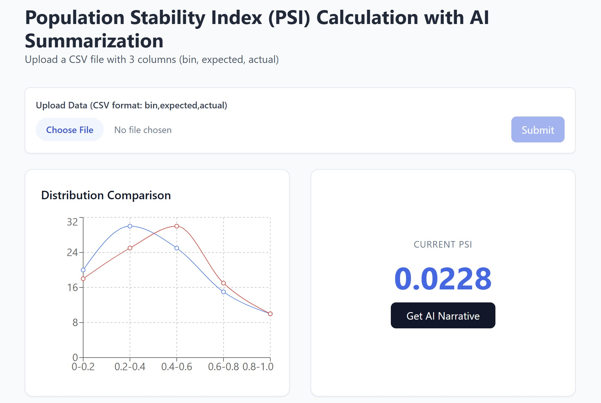

# PSI Calculator

A Simple web app to calculate PSI from 3-column CSV

## Purpose

All code here are created with GenAI in March 2026. The purpose of this app is to demonstrate the power of GenAI in building such a web app.



## App Development

A prompt-based approach was to generate the core source code: 

```
Build an app to compute and plot Population Stability Index,
and create a narrative summary (e.g. whether the PSI fluctuates much, whether the PSI exceeds 0.25)

Let user upload their data.

In the "Upload Data" section, add a button to allow users to "Submit" the file chosen.
```

## Test Data

R and Python code are used to simulate a small sample data with `n_bins=20` and chosen `target_psi=0.15`. See `simulated_data_psi.csv`.

These data-simulation scripts were created using OpenAI ChatGPT as follows: 

```
Write R code to simulate some data for PSI calculation. Export the results in CSV

named "bin", "expected", "actual". Please only create the R script

Modify the code so that users can set a PSI, and then the data will be simulated according to the PSI chosen

Make a python version of this script. Set default PSI = 0.15; number of data points = 1e4; number of bins = 20
```

GenAI has its own risk. Use at your own discretion.
